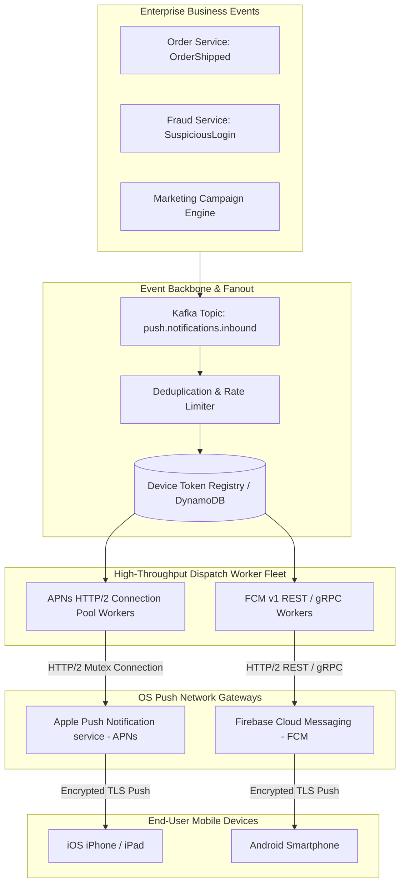
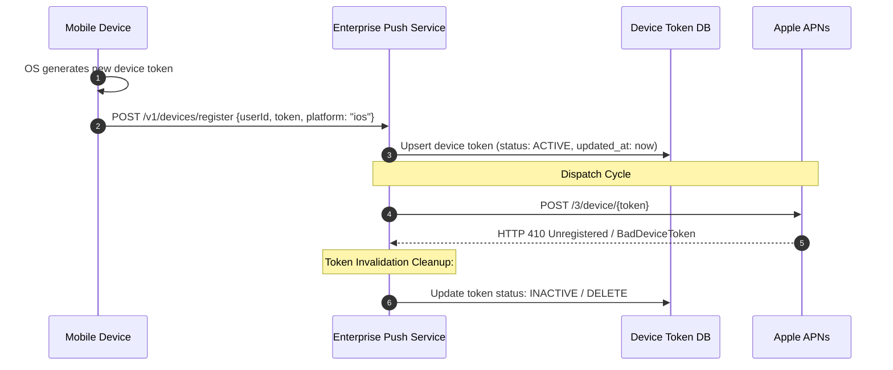

# Push Notification Architecture: APNs, FCM, Token Lifecycles, and High-Throughput Dispatch

## 1. Architectural Overview & Context
**Push Notification Infrastructure** enables an enterprise backend to asynchronously deliver real-time alerts, transactional updates, and engagement prompts to mobile devices across Apple iOS and Google Android operating systems.

Push notifications are fundamentally **best-effort, asynchronous side channels**, not reliable RPC mechanisms:
> **The First Law of Push Architecture**:
> *Never use push notifications as a guaranteed data transport mechanism. Notifications can be delayed, coalesced, or dropped entirely by device power-saving modes (iOS Low Power Mode, Android Doze), user notification toggles, or carrier drops.*

---

## 2. High-Throughput Push Notification Architecture Blueprint



---

## 3. APNs & FCM Protocol Mechanics

| Protocol Attribute | Apple Push Notification service (APNs) | Firebase Cloud Messaging (FCM v1) |
|---|---|---|
| **Transport Protocol** | **HTTP/2** over TLS 1.3 (Multiplexed requests over persistent connection) | **HTTP/2** or HTTP/1.1 REST / gRPC |
| **Authentication** | Token-based (**JWT with ES256 private key**) or mutual TLS certificate | OAuth 2.0 Short-Lived Access Token (Service Account) |
| **Maximum Payload Size** | **4 KB** (4096 bytes) for standard push; 5 KB for VoIP | **4 KB** (4096 bytes) for notification/data messages |
| **Silent Push Support** | `content-available: 1` (wakes app in background for up to 30s) | `content_available: true` / high priority data message |
| **Collapse / Coalescing** | `apns-collapse-id` (Overwrites stale notification with same ID) | `collapse_key` (Replaces older notifications) |

---

## 4. Device Token Lifecycle & Invalidation Architecture

Device tokens are not static hardware IDs; they mutate frequently:
* **Token Invalidation Triggers**: App reinstallation, user restores backup on a new device, OS updates, user clears app data.
* **The Ghost Token Problem**: Dispatching notifications to dead tokens wastes cloud egress bandwidth and can cause cloud gateways to throttle enterprise accounts.



---

## 5. Security & End-to-End Payload Encryption

Push notification payloads travel through third-party servers (Apple and Google):
* **Never transmit sensitive PII** (account numbers, medical test results, OTP passwords) in the plaintext push notification JSON payload!

### The Notification Service Extension (NSE) Architecture:
1. Backend sends push payload containing only an encrypted ciphertext payload and message ID:
   ```json
   { "aps": { "alert": "New Secure Message", "mutable-content": 1 }, "enc_data": "a8f9c1..." }
   ```
2. When the device receives the notification, the OS launches an ephemeral **Notification Service Extension (NSE)** process.
3. The NSE decrypts the ciphertext locally using a private key stored in the hardware Keychain.
4. The NSE mutates the alert text to display the decrypted message before rendering it to the user.

---

## 6. Push Notification Architectural Checklist
- [ ] Connect to APNs using persistent HTTP/2 connection pooling with JWT authentication.
- [ ] Implement automated token cleanup upon receiving HTTP `410 Unregistered` or `BadDeviceToken`.
- [ ] Utilize `collapse-id` keys for rapidly updating events (e.g. ride-share vehicle coordinates, sports scores).
- [ ] Restrict notification payloads to IDs and non-sensitive alerts; use Notification Service Extensions for PII decryption.
- [ ] Implement client-side and server-side deduplication keys to prevent double-delivery during network retries.
- [ ] Handle deep-link routing through a centralized URL scheme / Universal Links registry.

---

## 7. Related Modules
* [05-mobile/mobile-security/](../mobile-security/README.md) — Secure storage of push decryption keys in hardware Keychain.
* [07-integration/messaging/](../../07-integration/messaging/) — Kafka streaming and event-driven architectures.
* [02-system-design/fault-tolerance/](../../02-system-design/fault-tolerance/README.md) — Retry storms, backoff, and circuit breaking.
