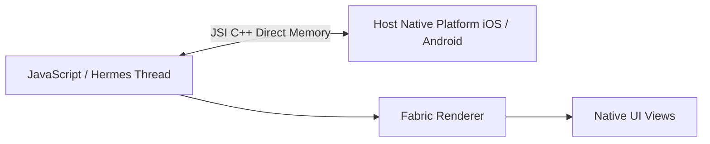

# React Native Architecture: Enterprise Project Structure in React Native

## 1. Architectural Purpose & Problem Context
Structuring monorepos, feature directories, and native iOS/Android bridge folders.

---

## 2. Runtime Mechanics & Bridge/JSI Architecture

---

## 3. Production Invariants & Best Practices
- Avoid serializing massive JSON strings across the native bridge; use JSI / TurboModules for direct C++ memory binding.
- Store sensitive tokens in iOS Keychain / Android Keystore via `react-native-keychain`; never use `AsyncStorage` for credentials.
