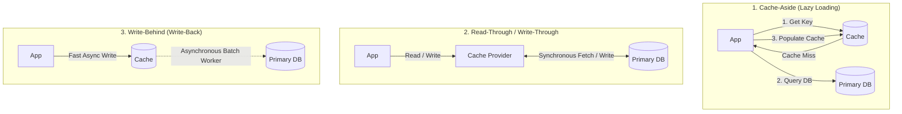
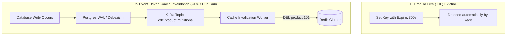

# Enterprise Caching Architecture: Patterns, Stampede Mitigation, and Invalidation

## 1. Architectural Overview & Context
Caching stores copies of frequently accessed data in high-speed, volatile memory tiers (RAM) to minimize latency, shield primary databases from load, and reduce cloud infrastructure expenditure.

However, as Phil Karlton famously noted:
> *"There are only two hard things in Computer Science: cache invalidation and naming things."*

Architecting a caching layer is not simply slapping Redis in front of a database. An incorrect caching strategy introduces stale reads, split-brain state, cache stampedes that crash production databases, and silent data corruption.

---

## 2. Core Caching Patterns Compared



| Caching Pattern | Read Latency | Write Latency | Data Freshness | Risk Profile |
|---|---|---|---|---|
| **Cache-Aside** | Low (on hit) | Normal | Eventual (TTL or manual eviction) | Cache stampede on miss; client handles fallback |
| **Read-Through** | Low (on hit) | Normal | Guaranteed sync | Cache provider failure blocks entire application |
| **Write-Through**| Low | Higher (Double write) | Immediate strong consistency | Higher write latency; writes uncached data |
| **Write-Behind** | Low | Ultra-Low (In-memory) | Eventual | High risk: Cache crash before flush causes **permanent data loss** |
| **Refresh-Ahead** | Sub-millisecond | Normal | High (Pre-computed) | Wasted compute if pre-fetched keys are never accessed |

---

## 3. The 3 Classic Cache Failure Modes & Mitigations

```
┌─────────────────────────────────────────────────────────────────────────────┐
│                         CACHE PRODUCTION DISASTERS                          │
├─────────────────────┬───────────────────────────────────────────────────────┤
│ 1. Cache Stampede   │ High-traffic key expires $\rightarrow$ 10,000 concurrent│
│ (Thundering Herd)   │ requests miss simultaneously and crush the database!  │
├─────────────────────┼───────────────────────────────────────────────────────┤
│ 2. Cache Penetration│ Queries for non-existent keys bypass cache repeatedly  │
│                     │ and hit primary database directly.                    │
├─────────────────────┼───────────────────────────────────────────────────────┤
│ 3. Cache Avalanche  │ Thousands of keys share identical TTL and expire at   │
│                     │ the exact same second, collapsing the backend.        │
└─────────────────────┴───────────────────────────────────────────────────────┘
```

### 3.1. Mitigating Cache Stampede: Mutex Locking & Probabilistic Early Expiration
* **Distributed Mutex Lock**: The first thread to detect a cache miss acquires a Redis lock (`SET NX EX 5`). All other threads wait or return a stale cached value while the lock holder regenerates the cache.
* **Probabilistic Early Expiry (XFetch Algorithm)**:
  $$\Delta t - \beta \times \ln(\text{random}()) > \text{TTL}$$
  Background workers probabilistically re-compute the cache *before* it officially expires based on current read velocity.

### 3.2. Mitigating Cache Penetration: Bloom Filters & Null Caching
* **Bloom Filter**: Intercept queries at the cache boundary; if the Bloom filter confirms the entity does not exist, reject immediately without querying Redis or database.
* **Cache Empty Objects**: If a query returns null, write a tombstone key into Redis with a short TTL (`ex=60s`).

### 3.3. Mitigating Cache Avalanche: TTL Jitter
* Never set static expiration intervals (`TTL = 3600s`).
* Always append randomized jitter: `TTL = 3600 + random(-300, 300)`.

---

## 4. Cache Invalidation Strategies



---

## 5. When Should You NOT Cache?

Caching introduces operational overhead and stale-data hazards. **Do NOT introduce a cache if:**
1. **Data mutates faster than it is read**: A write-heavy pipeline with low read-to-write ratio ($< 2:1$) will suffer constant cache thrashing with near-zero cache hit ratio.
2. **Access patterns are uniform across millions of unique keys**: If requests do not exhibit the **Pareto Principle (80/20 rule)**, the cache hit ratio will remain negligible.
3. **Data requires absolute linearizable consistency**: E.g., financial double-entry ledger balance transfers where an error budget is zero.

---

## 6. Enterprise Caching Architectural Checklist
- [ ] Calculate the expected cache hit ratio; do not deploy caches for workloads with $< 80\%$ expected hit rate.
- [ ] Enforce randomized TTL jitter on all keys to prevent Cache Avalanche.
- [ ] Implement Distributed Mutex Locking or XFetch algorithms on expensive hot queries.
- [ ] Apply Bloom filters or null-caching tombstones to protect against Cache Penetration attacks.
- [ ] Configure Redis memory eviction policies explicitly (e.g. `volatile-lru` or `allkeys-lfu`).
- [ ] Monitor Cache Hit Ratio ($\ge 90\%$), Memory Fragmentation Ratio, and Eviction Counts as core SLIs.

---

## 7. Related Modules
* [02-system-design/consistency/](../../02-system-design/consistency/README.md) — Consistency models, CAP theorem, and eventual consistency.
* [06-data/search/](../search/README.md) — Search indexing, inverted indexes, and query engines.
* [02-system-design/fault-tolerance/](../../02-system-design/fault-tolerance/README.md) — Circuit breaking and load shedding.
