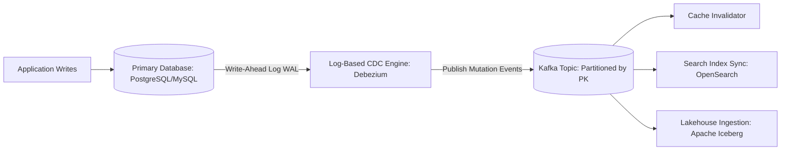

# CDC Architecture: CDC Failure Recovery, Snapshots & Historical Replay

## 1. Architectural Purpose & Problem Context
Recovering from connector crashes, consumer group offset resets, re-snapshotting tables, and handling missing WAL retention segments.

---

## 2. Structural Architecture & Pipeline Topology

---

## 3. Production Invariants
- Never use application dual-writes to sync databases and caches/search; always use log-based CDC or transactional outbox.
- Key CDC events strictly by primary key to ensure mutations for the same entity arrive on the same Kafka partition in order.
- Retain database transaction logs (WAL) long enough to survive connector outages without triggering full snapshot re-reads.
