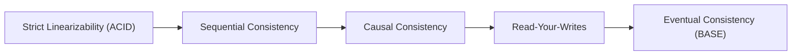

# Data Consistency: Conflict Resolution & Convergence Strategies

## 1. Architectural Purpose & Problem Context
Resolving concurrent multi-master and offline write conflicts: Last-Write-Wins (LWW) risks, Conflict-free Replicated Data Types (CRDTs), and domain merges.

---

## 2. Consistency Continuum Spectrum

---

## 3. Production Invariants
- Financial ledgers, monetary balances, and inventory reservations require strong consistency within their aggregate boundary.
- Do not use Last-Write-Wins (LWW) for critical business data; clock drift will cause silent data loss.
- Always communicate eventual consistency states clearly to user interfaces via optimistic updates and progress indicators.
