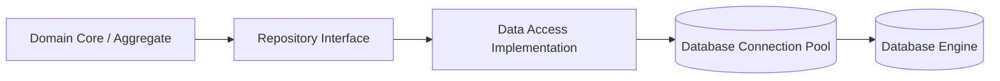

# Data Access: ORM vs Micro-ORM vs Raw SQL Architecture

## 1. Architectural Purpose & Problem Context
Evaluating developer velocity vs query transparency: Full ORMs (EF Core/Hibernate) vs Micro-ORMs (Dapper/JDBI) vs raw optimized SQL.

---

## 2. Interaction Layer Architecture

---

## 3. Production Invariants
- Application code must never hold database connections open while waiting for network I/O or third-party HTTP calls.
- Always use cursor/keyset-based pagination for large datasets; offset-based pagination degrades quadratically ($O(N^2)$) on deep pages.
- Enforce eager loading or explicit projection in high-volume API endpoints to eliminate N+1 query cascades.
