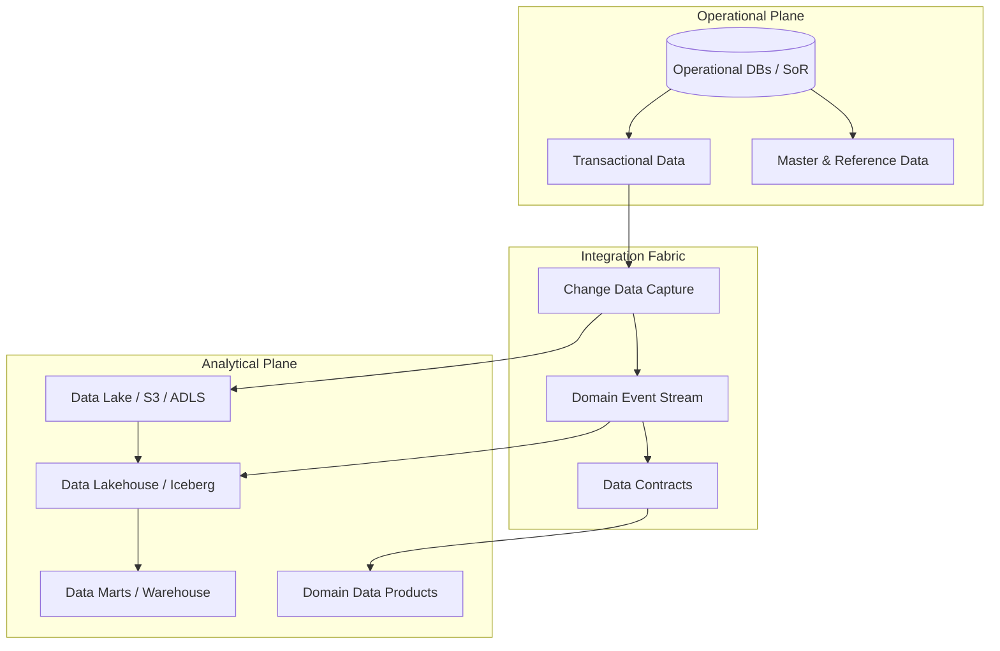

# Enterprise Data Architecture

Enterprise data architecture defines the strategic principles, organizational models, lifecycle governance, and persistence topologies governing how data is stored, categorized, protected, and operationalized across the enterprise.

---

## Architectural Taxonomy

---

## Knowledge Index
- [Data Architecture Overview](data-architecture-overview.md)
- [Data Architecture Principles](data-architecture-principles.md)
- [Data Domains & Bounded Contexts](data-domains.md)
- [Data Ownership & Technical Stewardship](data-ownership-stewardship.md)
- [Enterprise Data Lifecycle](data-lifecycle.md)
- [Data Classification & Sensitivity Models](data-classification-sensitivity.md)
- [Source of Truth vs System of Record](source-of-truth-vs-system-of-record.md)
- [Operational Data vs Analytical Data](operational-vs-analytical-data.md)
- [Master, Reference & Transactional Data Taxonomy](master-vs-reference-vs-transactional-data.md)
- [Data Contracts & Schema Governance](data-contracts.md)
- [Data Products & Data-as-a-Product](data-products.md)
- [Data Residency & Sovereignty Architecture](data-residency-sovereignty.md)
- [Data Retention, Archival & Cryptographic Deletion](data-retention-archival-deletion.md)
