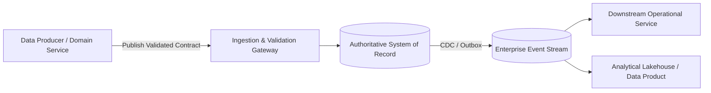

# Data Architecture: Data Contracts & Automated Schema Governance

## 1. Architectural Purpose & Problem Context
Enforcing explicit, versioned, machine-readable contracts between data producers and consumers to prevent silent downstream pipeline breakage.

Enterprise systems frequently suffer from unmanaged data sprawling, lack of clear ownership, inconsistent classification, and brittle integration when data architecture is treated as a low-level implementation detail rather than an enterprise discipline.

---

## 2. Structural Architecture & Domain Topology

---

## 3. Production Invariants & Decision Drivers
- Every critical data element must have an assigned domain owner and technical steward.
- Authoritative writes must occur exclusively within the designated System of Record.
- Schema changes must adhere to forward and backward compatibility governance rules.
- Data retention, residency, and privacy rules must be automated at the storage infrastructure layer.
