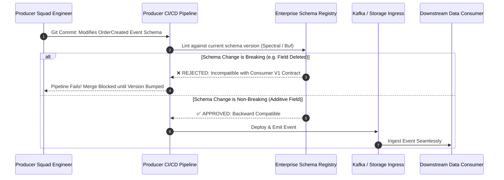
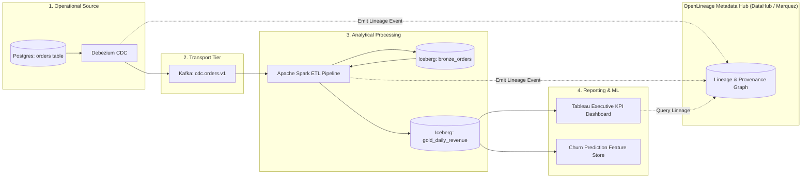

# Data Governance Architecture: Ownership, Lineage, Data Contracts, and Privacy

## 1. Architectural Overview & Context
**Enterprise Data Governance** establishes the policies, organizational operating models, automated controls, and technical standards that ensure enterprise data assets are trustworthy, discoverable, secure, compliant, and architecturally sovereign.

In high-growth organizations without formal data governance, data architectures rapidly devolve into unmanageable "data swamps":
> **The Data Swamp Anti-Pattern**:
> *Hundreds of upstream microservice schema changes silently break downstream analytical dashboards and ML pipelines; nobody knows who owns which table; PII is replicated into untracked S3 buckets; and regulatory compliance audits take six months of manual archaeology.*

```
┌─────────────────────────────────────────────────────────────────────────────┐
│                     THE 5 PILLARS OF DATA GOVERNANCE                        │
├─────────────────────┬───────────────────────────────────────────────────────┤
│ 1. Data Ownership   │ Domain squads own their data products as first-class  │
│                     │ engineering deliverables with published SLOs.         │
├─────────────────────┼───────────────────────────────────────────────────────┤
│ 2. Data Contracts   │ Machine-readable schema agreements enforced in CI/CD  │
│                     │ between upstream producers and downstream consumers.  │
├─────────────────────┼───────────────────────────────────────────────────────┤
│ 3. Data Lineage     │ Automated graph tracking of data origins, transforms, │
│                     │ and downstream pipeline dependencies (OpenLineage).   │
├─────────────────────┼───────────────────────────────────────────────────────┤
│ 4. Quality & Health │ Continuous validation of Accuracy, Completeness,      │
│                     │ Timeliness, Uniqueness, and Schema Validity.          │
├─────────────────────┼───────────────────────────────────────────────────────┤
│ 5. Security/Privacy │ Automated data classification, column-level masking,  │
│                     │ row-level security, and GDPR/CCPA right-to-forget.    │
└─────────────────────┴───────────────────────────────────────────────────────┘
```

---

## 2. Shift-Left Data Contracts Architecture

Data contracts shift governance from post-hoc pipeline patching to upstream development:



---

## 3. Automated Data Lineage Architecture (OpenLineage)

Tracing how a metric in an executive dashboard originates from raw database mutations requires an automated **Data Lineage Graph**:



---

## 4. The 6 Dimensions of Data Quality

Data pipelines must integrate automated assertions (e.g., Great Expectations, Soda Core) to validate quality before loading gold-tier business tables:

| Dimension | Definition | Automated Assertion Example |
|---|---|---|
| **1. Completeness** | Absence of unexpected null or missing values | `expect_column_values_to_not_be_null('customer_id')` |
| **2. Uniqueness** | Zero duplicate records across primary key fields | `expect_compound_columns_to_be_unique(['order_id', 'line_item_id'])` |
| **3. Validity** | Data conforms to defined format, range, or enum | `expect_column_values_to_be_in_set('status', ['PENDING', 'PAID', 'SHIPPED'])` |
| **4. Accuracy** | Value represents real-world ground truth | Cross-reconciliation against bank settlement statement amount |
| **5. Consistency** | Values match across multiple system copies | Comparing inventory count in ERP vs WMS database |
| **6. Timeliness** | Data latency satisfies agreed business freshness SLO | `expect_row_created_timestamp_to_be_within(now() - 15.minutes)` |

---

## 5. Privacy Architecture: GDPR, CCPA, and Right-to-be-Forgotten

When an EU customer exercises their **GDPR Article 17 (Right to Erasure)**, an enterprise must delete all customer PII across both operational databases and immutable analytical data lakes.

```
┌───────────────────────────────────────┐         ┌───────────────────────────────────────┐
│ Traditional Data Lake (Parquet on S3) │         │ Cryptographic Erasure (Crypto-Shred)  │
├───────────────────────────────────────┤         ├───────────────────────────────────────┤
│ Rewriting massive multi-gigabyte      │         │ 1. Every customer PII field encrypted │
│ immutable Parquet files across        │  ──►───►│    with unique per-customer key $K_c$.│
│ historical partitions is computationally│       │ 2. To delete customer: Simply DELETE  │
│ prohibitive and corrupts backups!     │         │    $K_c$ from KMS!                    │
│                                       │         │ 3. All historical lakehouse Parquet   │
│                                       │         │    records rendered cryptographically │
│                                       │         │    unreadable instantly!              │
└───────────────────────────────────────┘         └───────────────────────────────────────┘
```

---

## 6. Data Governance Architectural Checklist
- [ ] Implement machine-readable Data Contracts with CI/CD schema compatibility checks.
- [ ] Tag all columns with formal data classifications (`PUBLIC`, `INTERNAL`, `CONFIDENTIAL`, `RESTRICTED_PII`).
- [ ] Emit automated OpenLineage metadata events from all ETL, Spark, and dbt transformation jobs.
- [ ] Enforce automated data quality assertions (Great Expectations) at the bronze-to-silver ingestion boundary.
- [ ] Implement Cryptographic Erasure (Crypto-Shredding) for scalable GDPR/CCPA right-to-forget compliance.
- [ ] Integrate an enterprise data catalog (DataHub, Amundsen) for centralized search and lineage discovery.

---

## 7. Related Modules
* [01-architecture/data-architecture/](../../01-architecture/data-architecture/README.md) — Lakehouse paradigms, operational vs analytical planes, and Data Mesh.
* [06-data/data-lakes/](../data-lakes/README.md) — Open table formats (Apache Iceberg) and schema evolution.
* [10-security/](../../10-security/) — Regulatory compliance, data masking, and cryptographic key lifecycles.
