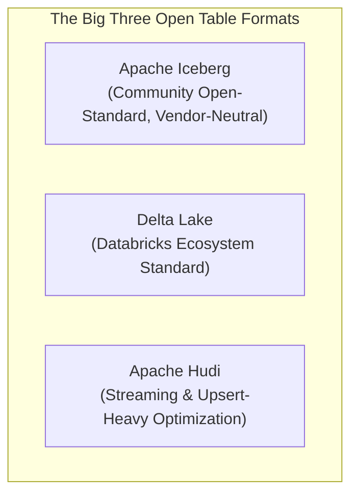
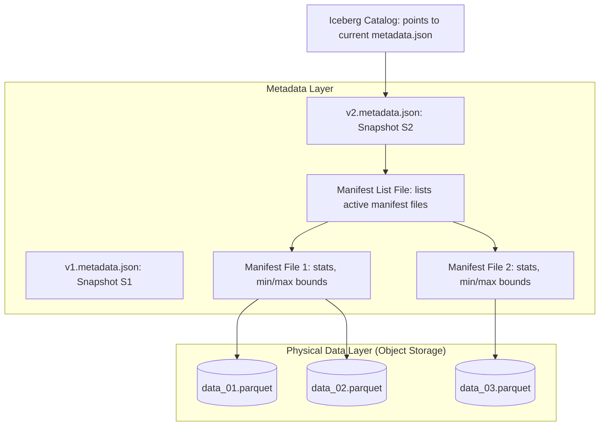

# Modern Data Lake & Lakehouse Architecture: Iceberg, Delta Lake, and Open Formats

## 1. Architectural Overview & Context
A **Modern Data Lakehouse** merges the inexpensive scalability, format flexibility, and open storage of a Data Lake with the ACID transaction guarantees, schema enforcement, and high-performance indexing of an Enterprise Data Warehouse.

First-generation data lakes (raw CSV/JSON on S3 or HDFS) suffered from critical architectural flaws:
* No atomic writes (partial pipeline failures corrupted historical datasets).
* Inability to execute updates or deletes without rewriting entire directory partitions.
* Terrible query performance due to millions of tiny files and lack of file-level pruning.

The Lakehouse architecture solves these issues by introducing an **Open Table Format Layer** on top of cloud object storage:

```
┌─────────────────────────────────────────────────────────────────────────────┐
│                    MODERN DATA LAKEHOUSE ARCHITECTURE                       │
├─────────────────────┬───────────────────────────────────────────────────────┤
│ Distributed Compute │ Decoupled query engines: Trino, Apache Spark, DuckDB  │
├─────────────────────┼───────────────────────────────────────────────────────┤
│ Open Table Format   │ Apache Iceberg / Delta Lake / Apache Hudi             │
│                     │ (ACID snapshots, time-travel, hidden partitioning)    │
├─────────────────────┼───────────────────────────────────────────────────────┤
│ Open File Storage   │ Apache Parquet / ORC (Columnar, compressed with ZSTD) │
├─────────────────────┼───────────────────────────────────────────────────────┤
│ Cloud Object Store  │ AWS S3 / Azure Blob / Google Cloud Storage            │
└─────────────────────┴───────────────────────────────────────────────────────┘
```

---

## 2. Open Table Formats Compared: Iceberg vs. Delta Lake vs. Hudi



| Architectural Feature | Apache Iceberg | Delta Lake | Apache Hudi |
|---|---|---|---|
| **Governance Body** | Apache Software Foundation | Linux Foundation / Databricks | Apache Software Foundation |
| **Catalog Independence** | Exceptional (REST Catalog, JDBC, Hive, AWS Glue) | Good (Unity Catalog, Hive Metastore) | Moderate (Hive Metastore) |
| **ACID Isolation** | Snapshot Isolation via atomic metadata pointer swap | Serializable via append-only JSON transaction log | Snapshot Isolation & Read Committed |
| **Schema Evolution** | Full (Add, Drop, Rename, Reorder, Type widening) | Full in recent versions | Full |
| **Partitioning Strategy** | **Hidden Partitioning** (Query does not need to know physical layout) | Explicit directory-based partitioning | Explicit directory / virtual key partitioning |
| **Merge-on-Read (MoR)** | Yes (Equality & Position delete files) | Yes (Deletion vectors in UniForm) | Industry leader in MoR upserts |
| **Engine Ecosystem** | Universal (Snowflake, BigQuery, Trino, Spark, DuckDB) | Universal via UniForm; native in Databricks | Spark, Trino, Flink |

---

## 3. How Apache Iceberg Achieves ACID on Object Storage

Iceberg tracks tables at the **file level**, completely eliminating directory-listing overhead:



### The Atomic Commit Mechanism:
1. Writers generate new Parquet data files and write a new manifest list.
2. The writer attempts an atomic compare-and-swap (CAS) operation in the Catalog to update the table pointer from `v1.metadata.json` to `v2.metadata.json`.
3. If another writer committed first, the commit fails gracefully and retries automatically without leaving corrupt partial files!

---

## 4. Hidden Partitioning & File Pruning Performance

In traditional Hive-style lakes, queries were forced to match directory structures (`WHERE year=2026 AND month=09`). If a user queried `WHERE event_timestamp > '2026-09-01'`, the engine had to scan every file in the table!

### Iceberg Hidden Partitioning:
* Partition transformations (e.g. `day(event_timestamp)`, `bucket(100, user_id)`) are stored in table metadata.
* Queries specify ordinary business columns (`WHERE event_timestamp = '2026-09-06'`), and Iceberg automatically uses manifest min/max column statistics to **prune 95%+ of irrelevant Parquet files** before reading a single byte from S3.

---

## 5. Automated Table Maintenance Operations

A data lakehouse requires background maintenance jobs to maintain peak query performance:

```
┌─────────────────────────────────────────────────────────────────────────────┐
│                       LAKEHOUSE MAINTENANCE RUNBOOK                         │
├─────────────────────┬───────────────────────────────────────────────────────┤
│ 1. Small File       │ Streaming ingestion creates thousands of tiny 500KB   │
│    Compaction       │ files. Compact regularly into optimal 128MB - 512MB   │
│                     │ Parquet files.                                        │
├─────────────────────┼───────────────────────────────────────────────────────┤
│ 2. Snapshot         │ Expire snapshots older than 14 days to free disk      │
│    Expiration       │ storage and maintain compact manifest lists.          │
├─────────────────────┼───────────────────────────────────────────────────────┤
│ 3. Orphan File      │ Delete uncommitted or crashed data files from S3 that │
│    Cleanup          │ are not referenced by any valid metadata snapshot.    │
└─────────────────────┴───────────────────────────────────────────────────────┘
```

---

## 6. Modern Data Lakehouse Architectural Checklist
- [ ] Adopt an open table format (Apache Iceberg preferred) to prevent proprietary storage lock-in.
- [ ] Standardize on Parquet with Zstandard (ZSTD) compression for optimal scan performance.
- [ ] Implement Iceberg Hidden Partitioning to prevent query performance cliffs.
- [ ] Schedule automated small file compaction jobs (bin-packing) every 6–12 hours.
- [ ] Enable S3 Intelligent-Tiering to automatically move historical bronze partitions to cold storage.
- [ ] Decouple storage from compute: query tables with Trino for interactive SQL, Spark for ETL, and DuckDB for local analytics.

---

## 7. Related Modules
* [01-architecture/data-architecture/](../../01-architecture/data-architecture/README.md) — Lakehouse paradigms, Data Mesh, and operational vs analytical planes.
* [06-data/data-governance/](../data-governance/README.md) — Data contracts, automated lineage, and crypto-shredding.
* [06-data/data-warehouses/](../data-warehouses/README.md) — Dimensional modeling, star schemas, and analytical data marts.
