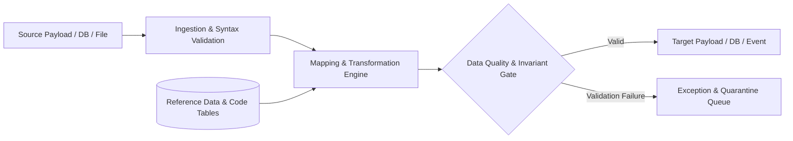

# Enterprise Data Mapping & Transformation Architecture

Data mapping establishes the formal, deterministic correspondence between data elements originating in disparate applications, APIs, event streams, files, databases, or legacy formats into standardized target domain representations.

---

## The Enterprise Data Mapping Pipeline

---

## Knowledge Index
- [Data Mapping Overview & Enterprise Role](data-mapping-overview.md)
- [Source-to-Target (S2T) Specification Methodology](source-to-target-mapping.md)
- [Field, Record & Entity Mapping Hierarchies](field-record-entity-mapping.md)
- [API Payload Mapping & DTO Translation](api-payload-mapping.md)
- [Database & ORM Mapping Patterns](database-mapping.md)
- [Event & Message Schema Mapping](event-mapping.md)
- [File, Flat-File & Batch Mapping](file-and-batch-mapping.md)
- [Legacy & Mainframe Integration Mapping](legacy-integration-mapping.md)
- [Canonical Data Model (CDM) Architecture](canonical-data-model.md)
- [Direct vs Lookup & Reference-Data Mapping](direct-vs-lookup-mapping.md)
- [Conditional Transformations & Branching Rules](conditional-transformations.md)
- [Aggregation, Splitting & Normalization](aggregation-and-splitting.md)
- [Code Translation Tables & Enumeration Mappings](code-translation-tables.md)
- [Null Handling, Defaults & Optionality Governance](null-handling-and-defaults.md)
- [Data Cleansing & Standardization Pipelines](data-cleansing-standardization.md)
- [Financial Data Mapping & Precision Controls](financial-data-mapping.md)
- [Settlement Data Mapping Architecture](settlement-data-mapping.md)
- [Reconciliation Data Mapping Architecture](reconciliation-data-mapping.md)
- [Mapping Versioning, Lineage & Impact Analysis](mapping-versioning-and-lineage.md)
- [Mapping Testing, Verification & Test Automation](mapping-testing-and-verification.md)
