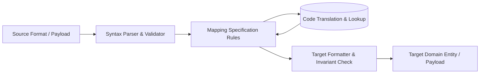

# Data Mapping: Mapping Versioning, Lineage & Impact Analysis

## 1. Architectural Purpose & Problem Context
Semantic versioning of mapping specifications, backward compatibility rules, automated CI regression checks, and column-level lineage tracking.

Data mapping is a mission-critical architectural layer. Ad-hoc, hardcoded field conversions in application code lead to silent data corruption, unmaintainable coupling, and disastrous integration regressions.

---

## 2. Structural Mapping Topology & Flow

---

## 3. Production Invariants & Governance Rules
- Every data mapping must be documented via a formal [Data Mapping Specification](../../16-architecture-deliverables/DATA-MAPPING-TEMPLATE.md).
- Mapping logic must be strictly versioned and subject to automated regression unit tests.
- Code translations must provide explicit exception paths for unrecognized codes rather than failing silently.
- Financial mappings must enforce exact decimal precision and banker's rounding rules.
