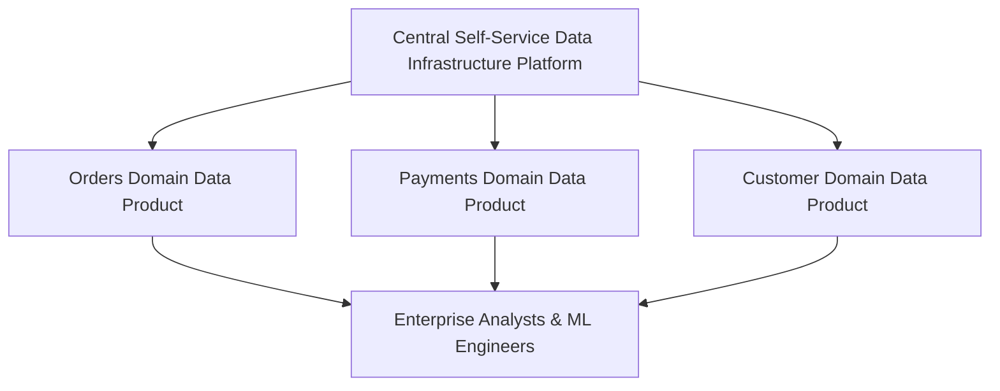

# Data Mesh: Federated Computational Governance Architecture

## 1. Architectural Purpose & Problem Context
Balancing domain autonomy with enterprise standards: automated policy-as-code, global identity, access governance, and compliance.

---

## 2. Data Mesh Organizational & Technical Model

---

## 3. Production Invariants
- Data Mesh is an organizational strategy, not a software tool; never attempt Data Mesh without decentralized domain product engineering squads.
- Central platform teams must focus exclusively on self-service automation, not data transformation pipelines.
