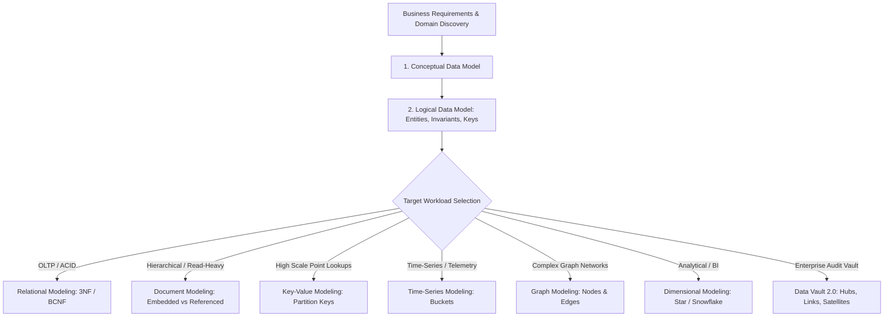

# Enterprise Data Modeling

Data modeling is the foundational engineering practice of abstracting real-world enterprise domain concepts into formal structural representations that balance transactional integrity, query performance, and operational maintainability.

---

## Modeling Paradigms Across the Enterprise

---

## Knowledge Index
- [Conceptual, Logical & Physical Modeling](conceptual-logical-physical.md)
- [Relational Modeling & Normalization](relational-modeling.md)
- [Document Database Modeling](document-modeling.md)
- [Key-Value Modeling & Partition Key Design](key-value-modeling.md)
- [Wide-Column Database Modeling](wide-column-modeling.md)
- [Graph Database Modeling](graph-modeling.md)
- [Time-Series Data Modeling](time-series-modeling.md)
- [Dimensional Modeling: Star & Snowflake Schemas](dimensional-modeling-star-snowflake.md)
- [Data Vault 2.0 Modeling](data-vault-modeling.md)
- [CQRS Read & Write Models](cqrs-read-write-models.md)
- [Event Modeling & Append-Only State](event-modeling.md)
- [Schema Evolution & Compatibility Strategies](schema-evolution-compatibility.md)
