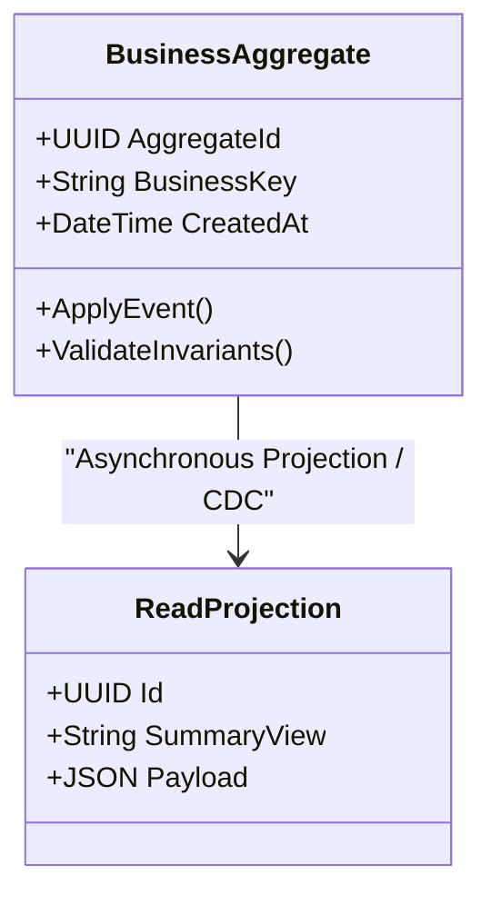

# Data Modeling: Schema Evolution: Backward, Forward & Full Compatibility

## 1. Architectural Purpose & Problem Context
Governing schema mutations across Avro, Protobuf, JSON Schema, and relational DDL: default fields, optionality, field removal, and migration phases.

Data models dictate the latency, throughput, consistency boundaries, and evolution agility of enterprise platforms. Flawed data modeling cannot be repaired by scaling hardware.

---

## 2. Structural Model & Conceptual Blueprint

---

## 3. Production Invariants & Modeling Guidelines
- Model according to access patterns and business invariants, not arbitrary technical preferences.
- Keep transaction boundaries aligned with aggregate boundaries.
- Never allow unbounded nested collections in document databases.
- Ensure all historical updates maintain an unambiguous temporal audit trail.
