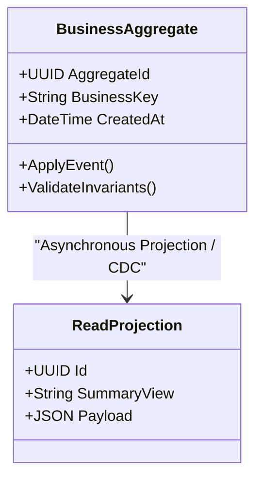

# Data Modeling: Time-Series Data Modeling: Bucketing & Downsampling

## 1. Architectural Purpose & Problem Context
Optimizing append-heavy temporal telemetry: time-bucket chunking, retention policies, compression algorithms (Gorilla/Delta), and continuous downsampling.

Data models dictate the latency, throughput, consistency boundaries, and evolution agility of enterprise platforms. Flawed data modeling cannot be repaired by scaling hardware.

---

## 2. Structural Model & Conceptual Blueprint

---

## 3. Production Invariants & Modeling Guidelines
- Model according to access patterns and business invariants, not arbitrary technical preferences.
- Keep transaction boundaries aligned with aggregate boundaries.
- Never allow unbounded nested collections in document databases.
- Ensure all historical updates maintain an unambiguous temporal audit trail.
