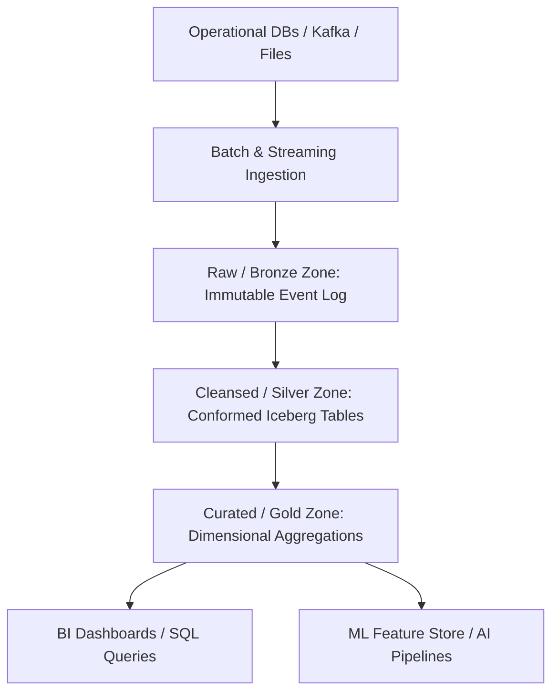

# Data Platforms: Operational Data Store (ODS) Architecture

## 1. Architectural Purpose & Problem Context
Interim staging stores supporting operational reporting: near-real-time integration, low latency, and isolating analytical queries from core OLTP systems.

---

## 2. Modern Lakehouse Platform Architecture

---

## 3. Production Invariants
- Prefer modern open table formats (Apache Iceberg / Delta Lake) over proprietary locked warehouse formats.
- Maintain immutable raw audit layers to allow full historical recomputation of downstream silver/gold tables.
