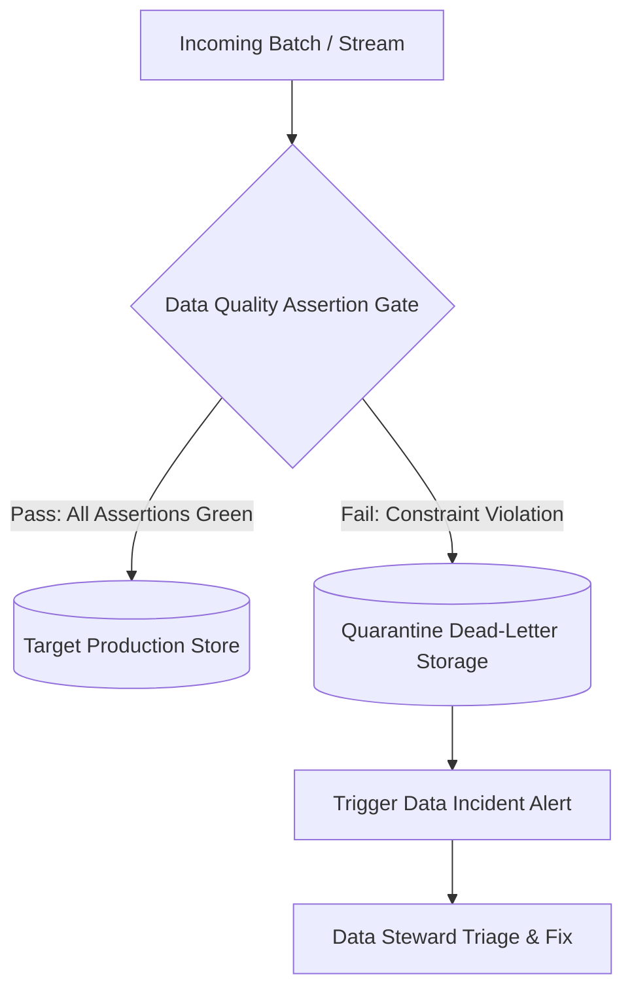

# Data Quality: Automated Data Quality Testing & Assertion Frameworks

## 1. Architectural Purpose & Problem Context
Integrating test assertions into CI/CD and runtime ingestion: Great Expectations, dbt tests, null checks, range validations, and schema drift checks.

---

## 2. Quality Assertion Pipeline

---

## 3. Production Invariants
- Corrupted or schema-violating data must be quarantined immediately; never allow invalid records to flow into downstream reporting tables.
- Track Data Quality SLAs as first-class operational metrics with automated weekly executive scorecards.
