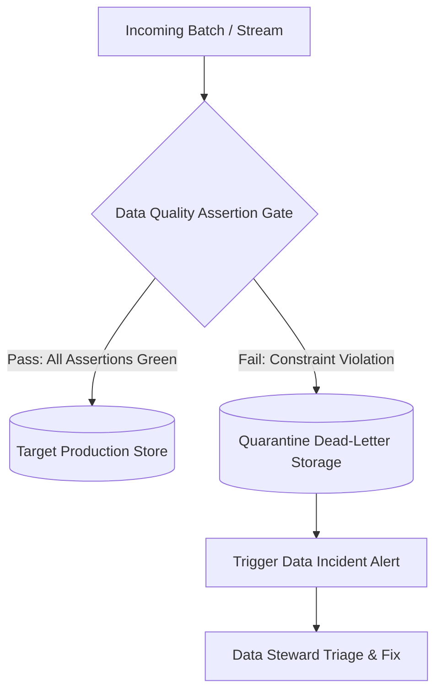

# Data Quality: Continuous Data Quality Monitoring & Anomaly Alerting

## 1. Architectural Purpose & Problem Context
Detecting silent corruption: row volume drops, distribution drift, null percentage spikes, and alerting via PagerDuty/Slack.

---

## 2. Quality Assertion Pipeline

---

## 3. Production Invariants
- Corrupted or schema-violating data must be quarantined immediately; never allow invalid records to flow into downstream reporting tables.
- Track Data Quality SLAs as first-class operational metrics with automated weekly executive scorecards.
