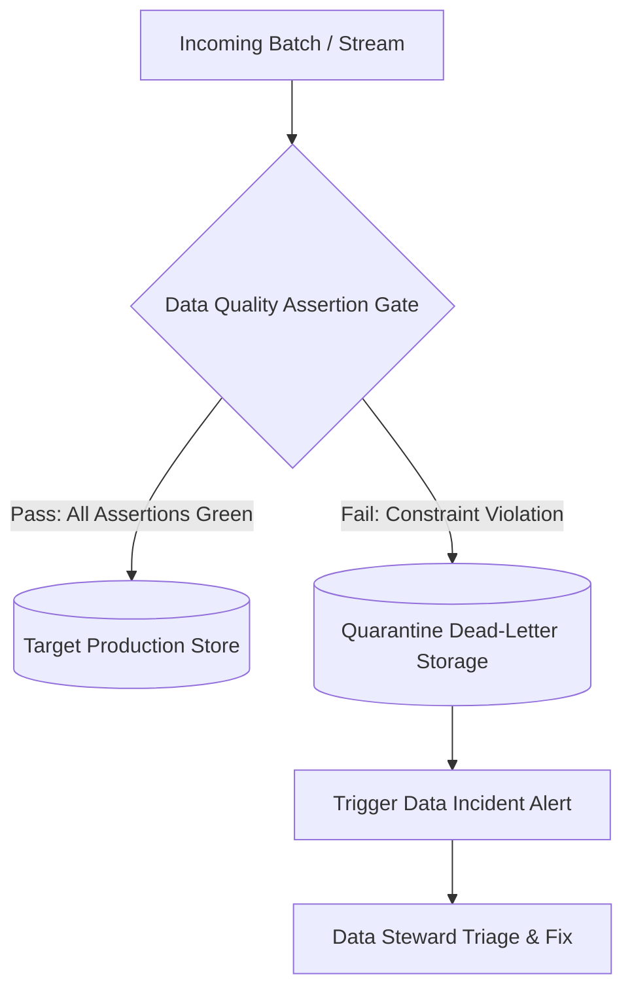

# Data Quality: Data Quality Ownership, SLAs & Error Budgets

## 1. Architectural Purpose & Problem Context
Defining Data Quality Service Level Agreements (SLAs), error budget burn rates, and holding upstream producing teams accountable for schema violations.

---

## 2. Quality Assertion Pipeline

---

## 3. Production Invariants
- Corrupted or schema-violating data must be quarantined immediately; never allow invalid records to flow into downstream reporting tables.
- Track Data Quality SLAs as first-class operational metrics with automated weekly executive scorecards.
