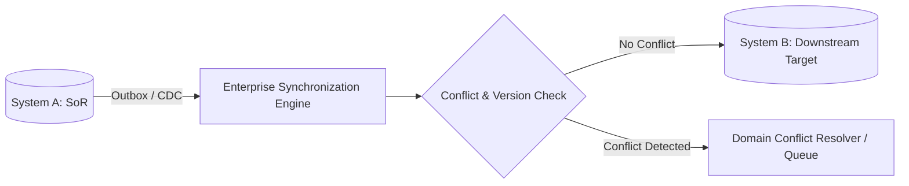

# Data Synchronization: One-Way vs Two-Way (Bidirectional) Synchronization

## 1. Architectural Purpose & Problem Context
Master-replica unidirectional synchronization vs complex bidirectional synchronization; infinite loop prevention and split-brain hazards.

---

## 2. Synchronization Topology & Conflict Resolution

---

## 3. Production Invariants
- Avoid bidirectional synchronization without strict partition ownership or automated conflict-resolution rules.
- Continuous hash-based data drift verification must run alongside real-time synchronization pipelines.
- In bidirectional systems, synchronize mutations with origin metadata tags to prevent recursive infinite echo loops.
