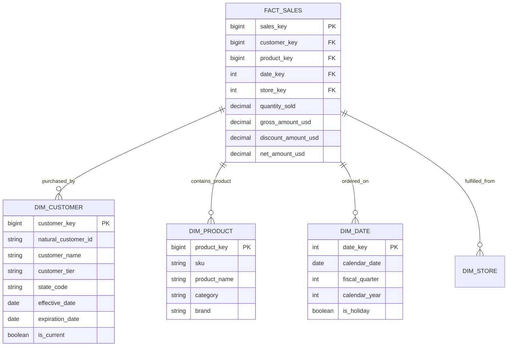
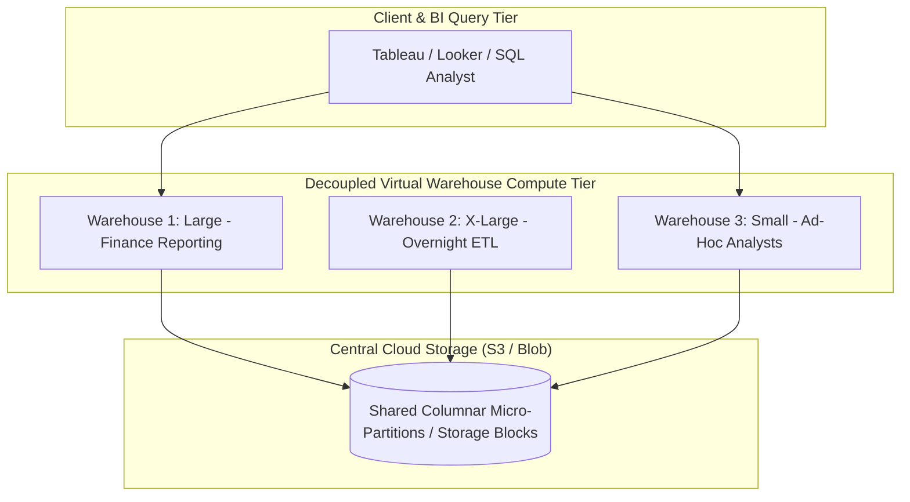

# Enterprise Data Warehouse Architecture: Dimensional Modeling, MPP Engines, and ELT

## 1. Architectural Overview & Context
An **Enterprise Data Warehouse (EDW)** is a centralized, subject-oriented, integrated, time-variant, and non-volatile analytical data repository designed to support executive reporting, business intelligence (BI), regulatory auditing, and ad-hoc analytical queries.

While operational databases are normalized (3rd Normal Form) to eliminate write redundancy, data warehouses are **denormalized using Dimensional Modeling** to maximize query read performance and human business comprehensibility.

```
┌─────────────────────────────────────────────────────────────────────────────┐
│                       OLTP vs. DATA WAREHOUSE (OLAP)                        │
├─────────────────────┬───────────────────────────────────────────────────────┤
│ Transactional (OLTP)│ Normalized (3NF) tables; fast single-row index reads; │
│                     │ strict row locks; handles thousands of TPS.           │
├─────────────────────┼───────────────────────────────────────────────────────┤
│ Warehouse (OLAP)    │ Dimensional Star Schemas; columnar storage; scans     │
│                     │ millions of rows; multi-node MPP query engines.       │
└─────────────────────┴───────────────────────────────────────────────────────┘
```

---

## 2. Dimensional Modeling: Star Schema Architecture

Following the **Kimball Methodology**, business processes are represented through Fact tables and Dimension tables:



### The 3 Core Fact Table Types:
1. **Transaction Fact Table**: One row per business event occurrence (e.g. cash register scan, credit card transaction).
2. **Periodic Snapshot Fact Table**: Captures state at a fixed time interval (e.g. end-of-day bank balance, monthly inventory balance).
3. **Accumulating Snapshot Fact Table**: Tracks a business lifecycle with defined milestone timestamps (e.g. Order Placed $\rightarrow$ Picked $\rightarrow$ Shipped $\rightarrow$ Delivered).

---

## 3. Slowly Changing Dimensions (SCD): Managing Historical Evolution

When an entity attribute mutates over time (e.g. customer changes their home state from California to Texas):

| SCD Technique | Mechanism | Example Consequence | When to Use |
|---|---|---|---|
| **SCD Type 1 (Overwrite)** | Overwrite old value with new value. Zero historical tracking. | Historical 2024 orders will now reflect "Texas" instead of "California". | Correcting typos or non-analytical attributes. |
| **SCD Type 2 (Add New Row)** | Add new dimension row with `effective_date`, `expiration_date`, and `is_current` flag. | Historical 2024 orders remain tied to California row; new 2026 orders link to Texas row! | **The gold standard** for enterprise analytical auditing. |
| **SCD Type 3 (Add Column)** | Add `current_state` and `previous_state` columns. | Tracks only last 1 transition. | Limited historical tracking. |
| **SCD Type 4 (Mini-Dimension)**| Extract rapidly changing attributes (e.g. credit score) into a separate lookup table. | Prevents explosive growth of primary customer dimension table. | Rapidly mutating customer attributes. |

---

## 4. Modern MPP Columnar Engines: Snowflake, BigQuery, and Redshift

Modern cloud warehouses utilize **Massively Parallel Processing (MPP)** architectures where storage and compute scale completely independently:



### Architectural Benefit of Workload Isolation:
A heavy 2-hour financial analytics query running on `WH1` has **zero impact** on the overnight data transformation pipeline running on `WH2`, eliminating resource contention!

---

## 5. Modern ELT with dbt (Transform in the Warehouse)

Traditional ETL transformed data outside the warehouse in dedicated servers (Informatica/Datastage) before loading. Modern architectures use **ELT (Extract, Load, Transform)**:
1. **Extract & Load**: Raw data ingested unmodified into warehouse staging tables (via Fivetran/Airbyte/Kafka).
2. **Transform (dbt - Data Build Tool)**: SQL transformations execute directly inside the MPP warehouse, leveraging its massive parallel query power with full version control, automated testing, and lineage DAGs.

---

## 6. Enterprise Data Warehouse Architectural Checklist
- [ ] Model analytical domains using Kimball Star Schemas with surrogate integer keys.
- [ ] Implement SCD Type 2 tracking for all critical dimension attributes subject to historical auditing.
- [ ] Separate compute clusters (virtual warehouses) by workload type (ETL vs BI vs Data Science) to prevent query contention.
- [ ] Enforce automated query timeout caps (e.g. kill queries exceeding 60 minutes) to prevent runaway compute costs.
- [ ] Implement dbt automated schema and uniqueness tests on all dimensional tables in CI/CD.
- [ ] Configure auto-suspend on idle compute clusters (default: 5 minutes) for FinOps optimization.

---

## 7. Related Modules
* [01-architecture/data-architecture/](../../01-architecture/data-architecture/README.md) — Lakehouse paradigms, Data Mesh, and operational vs analytical planes.
* [06-data/data-lakes/](../data-lakes/README.md) — Open table formats (Apache Iceberg) and lakehouse architectures.
* [08-cloud/cloud-cost-optimization/](../../08-cloud/cloud-cost-optimization/README.md) — FinOps cost governance for cloud compute and storage.
