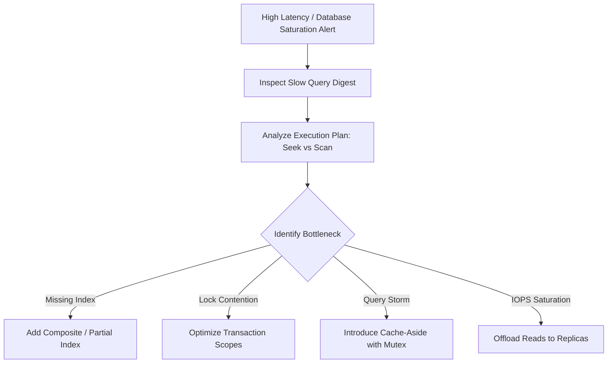

# Database Performance: Lock Contention & Hot Row Mitigation Strategies

## 1. Architectural Purpose & Problem Context
Remediating concurrency bottlenecks on heavily updated singleton rows: batching balance updates, optimistic concurrency, and partitioning queues.

---

## 2. Performance Diagnostic Workflow

---

## 3. Production Invariants
- No query in the critical customer transaction path should execute an unindexed sequential table scan.
- Transaction scopes must be kept as short as possible to minimize lock holding duration.
- Guard all database read caches with probabilistic early expiration or distributed locks to prevent catastrophic cache stampedes.
