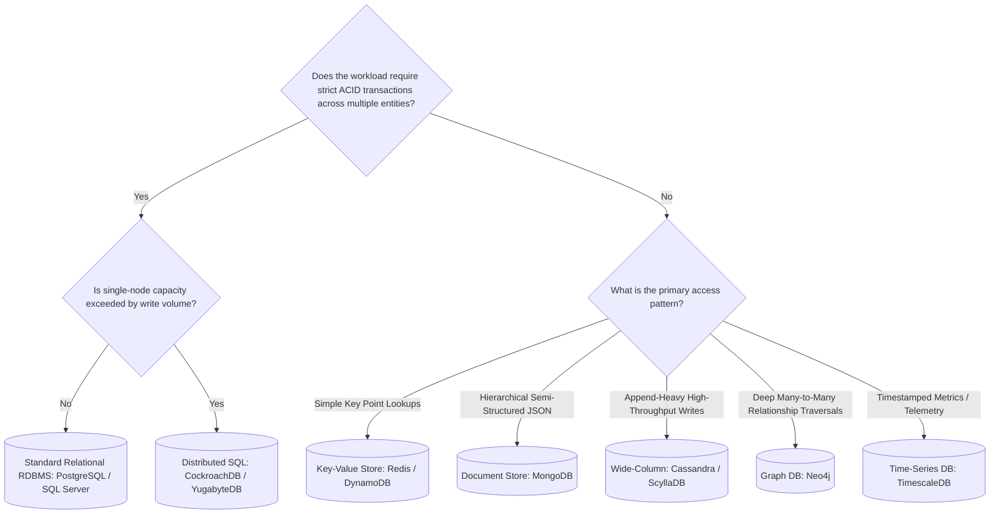

# Database Selection: Comprehensive Database Decision Criteria Matrix

## 1. Architectural Purpose & Problem Context
Side-by-side comparative rubric across Relational, Distributed SQL, Key-Value, Document, Wide-Column, Graph, and Time-Series paradigms.

---

## 2. Decision Tree Topology

---

## 3. Production Invariants
- Default to standard relational databases (e.g., PostgreSQL) unless explicit scale or data-model requirements justify alternative engines.
- Never adopt NoSQL solely for "scalability" without verifying that read/write access patterns align with the engine's query capabilities.
