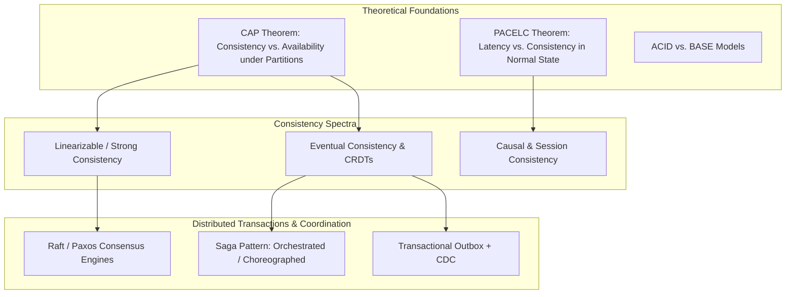

# Distributed Data Systems Architecture

## 1. Overview & Foundational Principles
Distributed data systems manage state across multiple interconnected physical nodes, data centers, and geographic regions. Building distributed data architectures requires relinquishing the comforting illusions of single-node computing: reliable networks, instantaneous clocks, zero-latency communication, and global instantaneous locks.

---

## 2. Directory Structure
* [CAP Theorem](cap-theorem.md)
* [PACELC Theorem](pacelc-theorem.md)
* [ACID vs. BASE](acid-vs-base.md)
* [Consistency Models](consistency-models.md)
* [Strong Consistency](strong-consistency.md)
* [Eventual Consistency](eventual-consistency.md)
* [Causal Consistency](causal-consistency.md)
* [Read-Your-Writes Consistency](read-your-writes.md)
* [Monotonic Reads](monotonic-reads.md)
* [Distributed Transactions](distributed-transactions.md)
* [Two-Phase Commit (2PC)](two-phase-commit.md)
* [Three-Phase Commit (3PC)](three-phase-commit.md)
* [Saga Pattern](saga-pattern.md)
* [Transactional Outbox Pattern](outbox-pattern.md)
* [Event Sourcing](event-sourcing.md)
* [CQRS Architecture](cqrs.md)
* [Distributed Locks](distributed-locks.md)
* [Consensus Algorithms](consensus-algorithms.md)
* [Raft Consensus Protocol](raft.md)
* [Paxos Consensus Protocol](paxos.md)
