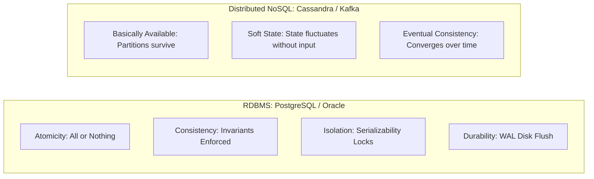

# ACID vs. BASE Data Models

## 1. Contrasting Philosophy
* **ACID (Pessimistic / Centralized)**: Focuses on mathematical correctness, immediate consistency, and isolated transaction execution. Traditional relational databases (RDBMS).
* **BASE (Optimistic / Distributed)**: Accepts that in large-scale distributed architectures, immediate consistency is too expensive. Prioritizes continuous availability, soft state, and eventual convergence.

---

## 2. Direct Architectural Comparison

| Dimension | ACID | BASE |
| :--- | :--- | :--- |
| **Guarantees** | Strong immediate consistency | Eventual consistency |
| **Locking Model** | Pessimistic locking (2PL, MVCC) | Optimistic concurrency / Conflict resolution |
| **Scalability** | Vertical scale-up; complex sharding | Seamless horizontal scale-out across nodes |
| **Network Cost** | High latency under distributed 2PC | Low latency via asynchronous replication |
| **Application Complexity** | Low (Database handles correctness) | High (Application handles convergence & race conditions) |
