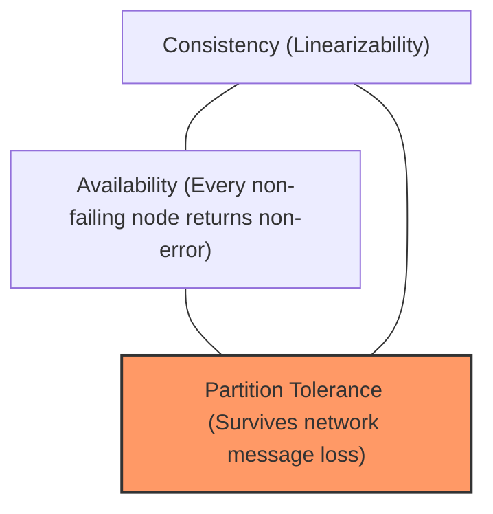

# CAP Theorem (Brewer's Theorem)

## 1. Formal Definition & The Real Trade-off
Formulated by Eric Brewer and mathematically proven by Seth Gilbert and Nancy Lynch, the **CAP Theorem** states that a distributed data store can simultaneously provide at most **two of three guarantees**:

* **Consistency (Linearizability)**: Every read receives the most recent write or an error.
* **Availability**: Every non-failing node returns a successful (non-error) response for every request (no guarantee it contains the latest write).
* **Partition Tolerance**: The system continues operating despite an arbitrary number of messages being dropped or delayed by the network between nodes.

---

## 2. Why "Pick 2 out of 3" Is a Myth: Network Partitions Are Inevitable
In physical reality, **you cannot "choose CA"**. Network cables get severed, top-of-rack switches fail, and cloud VPCs experience transient latency spikes. Network partitions ($P$) are a physical law of distributed networks.

The real formulation of the CAP theorem is:
> **During a network partition ($P$), does your architecture choose Consistency ($CP$) or Availability ($AP$)?**

### 1. CP Systems (Choose Consistency over Availability)
* If Node A cannot communicate with Node B, Node B rejects reads/writes to prevent serving stale data or split-brain.
* *Examples*: Apache ZooKeeper, Google Cloud Spanner, CockroachDB, etcd, MongoDB (with majority concern).
* *Business Case*: Banking ledgers, flight seat reservations, cryptographic key distribution.

### 2. AP Systems (Choose Availability over Consistency)
* Node B continues servicing reads and writes using its localized stale state. When the partition heals, data is asynchronously reconciled.
* *Examples*: Apache Cassandra, Amazon DynamoDB (eventual consistency mode), Couchbase.
* *Business Case*: Social media feeds, shopping carts, product reviews, IoT telemetry.
