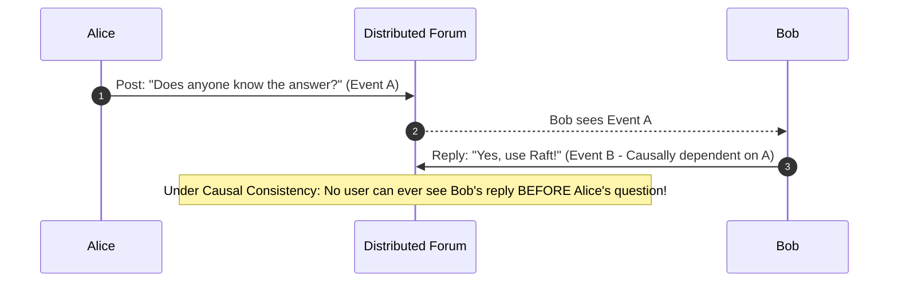

# Causal Consistency & Vector Clocks

## 1. The Happens-Before Relationship
Formulated by Leslie Lamport, **Causal Consistency** guarantees that operations that are causally related are observed in the exact same order by all nodes in a distributed cluster. Concurrent operations that have no causal relationship may be observed in differing orders.

$$a \to b \implies \text{Every node observes } a \text{ before } b$$

---

## 2. Vector Clocks Implementation
To track causality without a synchronized physical wall-clock, each node maintains a vector clock $V$ of size $N$ (where $N$ is the number of nodes):
$$V = \langle v_1, v_2, \dots, v_N \rangle$$
* When node $i$ generates an event: $V[i] = V[i] + 1$.
* When sending a message, node attaches its vector clock $V$.
* Receiving node updates its clock: $V_{\text{local}}[k] = \max(V_{\text{local}}[k], V_{\text{msg}}[k])$.
