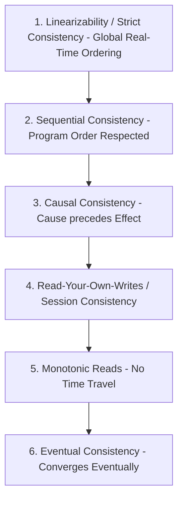

# Distributed Consistency Models Spectrum

## 1. The Consistency Hierarchy
Consistency in distributed systems is not binary (strong vs. weak). It is a spectrum spanning mathematical linearizability down to pure eventual consistency.

---

## 2. Summary of Models

| Consistency Model | Formal Guarantee | Client Visible Anomaly Prevented | Real-World Cost |
| :--- | :--- | :--- | :--- |
| **Linearizable** | Operations appear instantaneous on a global clock. | Stale reads, inverted order, split-brain. | Highest latency; requires consensus. |
| **Sequential** | All nodes see writes in the exact same sequence. | Nodes disagreeing on transaction order. | Synchronous sequencer / master required. |
| **Causal** | Operations causally related are seen in order. | Reading an answer before the question. | Tracked via Vector Clocks. |
| **Read-Your-Writes**| A user always sees their own updates. | Refreshing page and seeing old profile. | Session affinity routing. |
| **Eventual** | Replicas converge if no new writes arrive. | None (stale reads and out-of-order writes allowed). | Lowest latency; zero consensus cost. |
