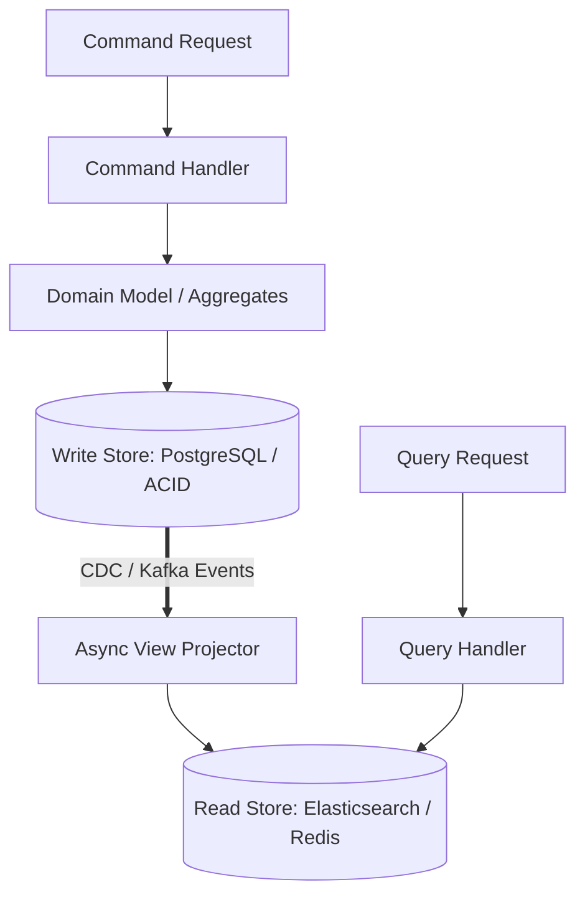

# Command Query Responsibility Segregation (CQRS)

## 1. Principles of Segregated Models
CQRS (Greg Young) separates the data model for **Commands** (mutations, business invariants) from the data model for **Queries** (reads, views):

---

## 2. Architectural Advantages & Trade-offs
* **Independent Scalability**: Scale write nodes based on transaction rate; scale read nodes (Elasticsearch / Redis) based on search volume.
* **Optimized Storage Engines**: Use 3NF relational for writes (eliminating anomalies); use pre-joined flat JSON documents for reads (eliminating SQL joins).
* **Trade-off: Eventual Consistency**: Read models lag behind write models by the event projection transit time ($\approx 10\text{--}200\text{ ms}$).
