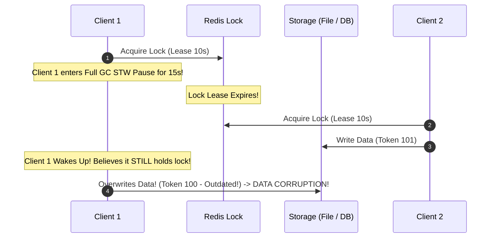

# Distributed Locks & Fencing Tokens

## 1. The Perils of Distributed Locking (Kleppmann's Critique)
A distributed lock ensures mutually exclusive access across distinct network processes. However, relying purely on lock leases (e.g., Redis TTL) without **Fencing Tokens** leads to silent data corruption:

---

## 2. Fencing Token Defense
1. The lock service returns a monotonically increasing **Fencing Token** on lock acquisition (e.g., Token 102).
2. The storage engine validates that every incoming write presents a token strictly higher than the last accepted write.
3. Client 1's write (Token 100) is rejected because Token 101 was already processed.
