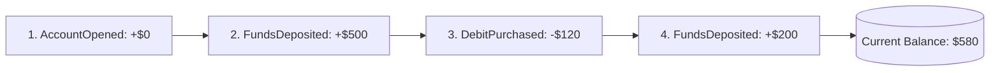

# Event Sourcing Architecture

## 1. Paradigm Shift: Events as the Single Source of Truth
Traditional CRUD databases store only the **current state** of an entity, permanently discarding historical context. **Event Sourcing** stores all changes as an append-only, immutable sequence of domain events:

$$\text{Current State}_t = \text{Fold}(\text{InitialState}, \text{Events}_{1..t})$$



---

## 2. Event Store Schema & Snapshots
```sql
CREATE TABLE event_store (
    aggregate_id     UUID NOT NULL,
    sequence_number  BIGINT NOT NULL,
    event_type       VARCHAR(128) NOT NULL,
    payload          JSONB NOT NULL,
    created_at       TIMESTAMP WITH TIME ZONE DEFAULT NOW(),
    PRIMARY KEY (aggregate_id, sequence_number)
);
```

### Snapshots (State Checkpointing)
Replaying 10,000 historical events to calculate an account balance degrades latency. The event store checkpoints a **Snapshot** every 100 events:
$$\text{Current State} = \text{Replay}(\text{Snapshot}_{1000}, \text{Events}_{1001..1042})$$
