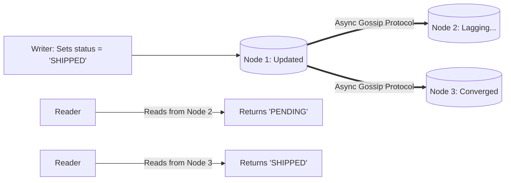

# Eventual Consistency Architecture

## 1. The Convergence Guarantee
A system provides **Eventual Consistency** if, when no further mutations are submitted, all replicas eventually converge and become identical:
$$\lim_{t \to \infty} P\left(\text{State}_A(t) = \text{State}_B(t)\right) = 1.0$$

During active writes, different replicas return different values, and clients may observe stale data or out-of-order events.

---

## 2. Conflict Resolution Mechanisms
When concurrent conflicting writes occur on different replicas without centralized coordination:
1. **Last-Write-Wins (LWW)**: Uses wall-clock timestamps (`timestamp = epoch_ms`). The write with the highest timestamp wins. *Hazard*: Clock drift causes newer writes to be silently deleted.
2. **Conflict-Free Replicated Data Types (CRDTs)**: Mathematically proven data structures (PN-Counters, OR-Sets) whose operations commute ($A \cup B = B \cup A$), allowing replicas to merge safely in any order.
3. **Application-Level Reconciliation**: Datastore stores all conflicting versions (siblings in DynamoDB / Riak); client application merges conflicts during next read.
