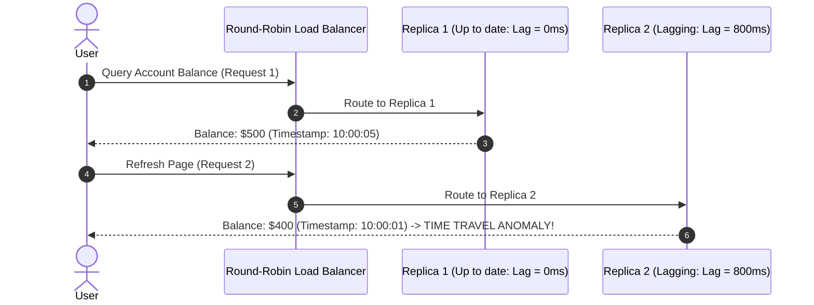

# Monotonic Reads Consistency

## 1. The "Time Travel" Anomaly
Monotonic reads prevent time-travel anomalies where a user observes a newer version of data, and subsequently observes an older version on a subsequent query.

---

## 2. Mitigation via Session Affinity
* **Hash-Based Client Routing**: Route requests using `Hash(user_id) % Total_Replicas` to pin a user session to a single replica.
* If that replica fails, failover to a new replica guaranteed to have equal or higher applied LSN.
