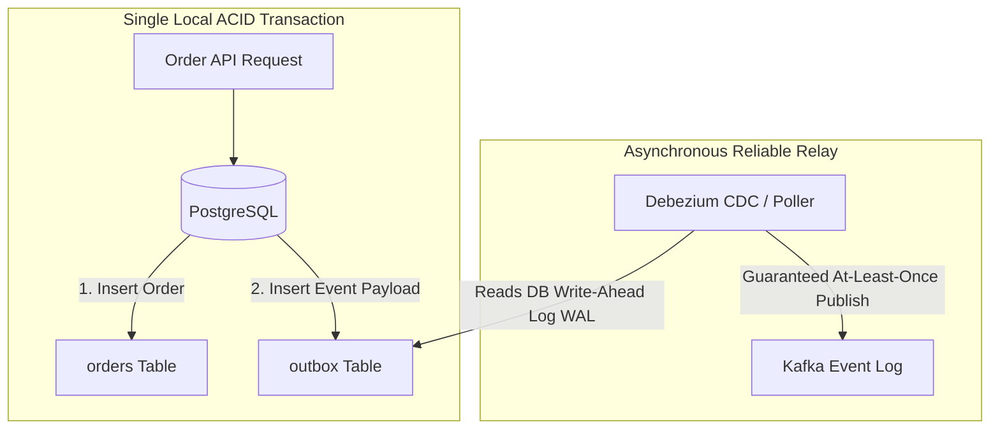

# Transactional Outbox Pattern

## 1. The Dual-Write Problem
In microservice architectures, updating a local database and publishing an event to a message broker (e.g., Kafka) within the same transaction is impossible without 2PC:
* If the database commit succeeds, but the message broker publish fails: downstream consumers never receive the event (Silent Data Inconsistency).
* If the broker publish succeeds, but the database commit fails: downstream consumers process phantom data (Ghost Mutation).

---

## 2. Implementation with Change Data Capture (CDC)
1. **Application Write**: The application executes an atomic local SQL transaction inserting into `orders` and `outbox`.
2. **WAL Streaming**: Debezium reads PostgreSQL's Write-Ahead Log (`pg_wal`), extracting outbox inserts with near-zero latency ($<10\text{ ms}$).
3. **Broker Publish**: Debezium publishes the event to Kafka and commits its offset once acknowledged.
4. **Result**: Guaranteed atomic event publication without distributed locks.
