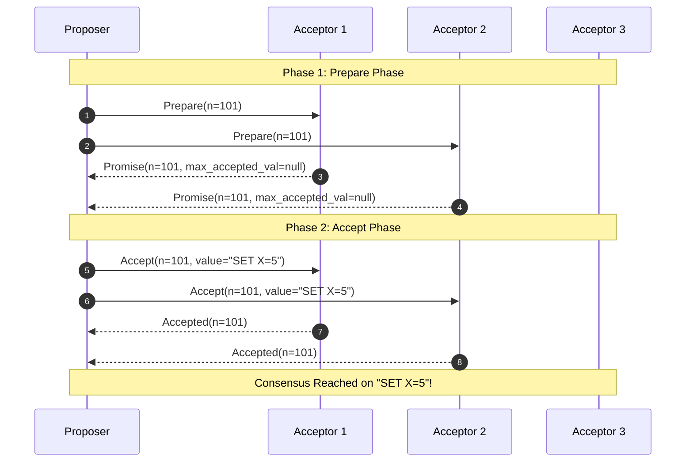

# Paxos Consensus Protocol

## 1. Foundations of Paxos
Formulated by Leslie Lamport (1998), **Paxos** is the foundational consensus protocol proving how distributed state machines can safely reach consensus across asynchronous, unreliable networks.

---

## 2. Basic Paxos vs. Multi-Paxos
* **Basic Paxos**: Reaches consensus on a single value (single decree). Requires 2 network round-trips per value.
* **Multi-Paxos**: Elects a stable long-term leader, bypassing Phase 1 for subsequent log appends, reducing write latency to **1 network round-trip** ($2\text{ RTT} \rightarrow 1\text{ RTT}$).
