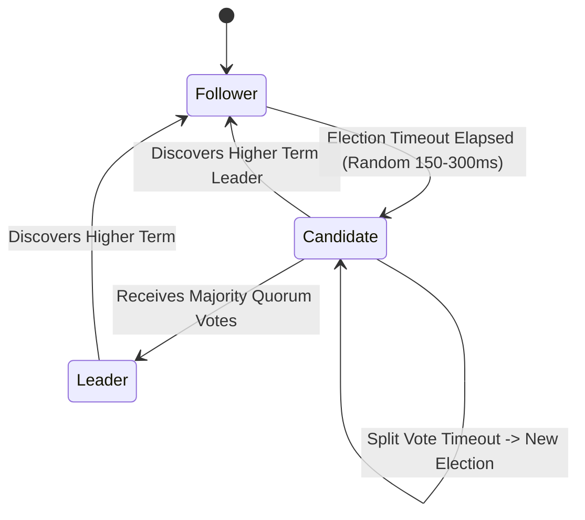

# Raft Consensus Protocol

## 1. Designed for Understandability
Created by Diego Ongaro and John Ousterhout (Stanford, 2014), **Raft** is an equivalent consensus algorithm to Multi-Paxos designed specifically for operational clarity and formal decomposition.

---

## 2. Decomposed Sub-Problems
1. **Leader Election**: Follower initiates election upon timeout; requests votes (`RequestVote` RPC). Leader maintains authority via regular heartbeats.
2. **Log Replication**: Leader receives commands from clients, appends to its log, and dispatches `AppendEntries` RPCs to followers.
3. **Commit Rule**: Once a log entry is replicated across a majority of nodes for the current term, the leader commits it and applies it to its local finite state machine (FSM).
