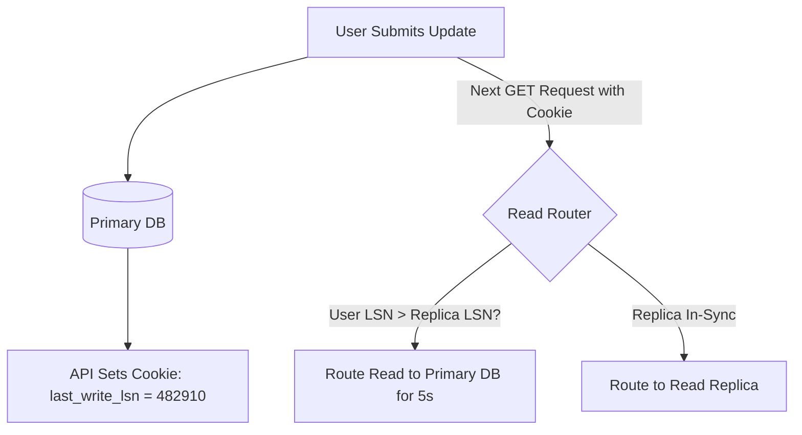

# Read-Your-Own-Writes Consistency

## 1. The User Experience Problem
In systems utilizing asynchronous read replicas:
1. User updates their profile bio (writes to primary).
2. Browser reloads and fetches bio (reads from a lagging replica).
3. User observes their old bio, believes the update failed, and submits it again.

**Read-Your-Own-Writes (RYOW)** consistency guarantees that an individual user will always observe the effects of their own updates, even if other users see stale data for a brief duration.

---

## 2. Implementation Strategies
* **Master Pinning Window**: Pin the updating user's subsequent reads to the primary database for 5 to 10 seconds post-mutation.
* **Log Sequence Number (LSN) Tracking**: Pass the transaction LSN in an HTTP response header or cookie; the read router queries replicas only if $\text{LSN}_{\text{replica}} \ge \text{LSN}_{\text{cookie}}$.
