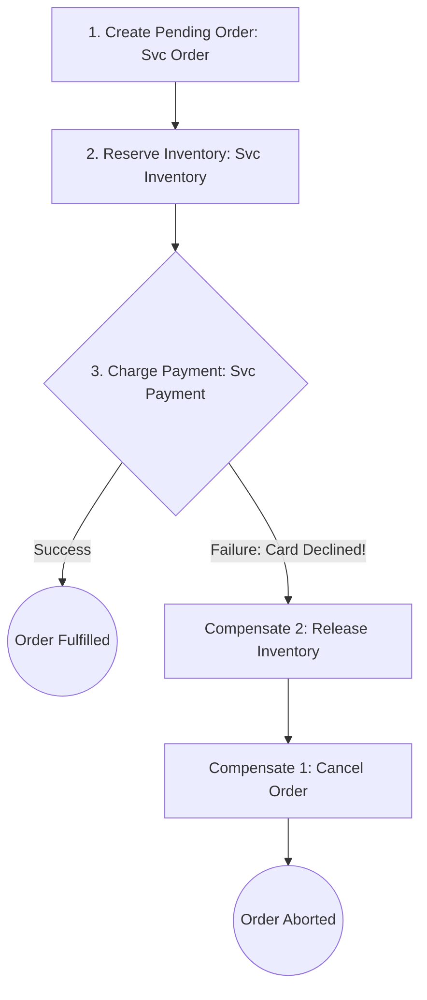

# The Saga Pattern

## 1. Long-Running Distributed Transactions
Formulated by Héctor García-Molina, a **Saga** is a sequence of local transactions:
$$T_1, T_2, T_3, \dots, T_n$$
Each local transaction updates data within a single microservice database using standard local ACID locks. If any transaction $T_k$ fails, the Saga coordinates a series of **Compensating Transactions** in reverse order to undo changes:
$$C_{k-1}, C_{k-2}, \dots, C_1$$

---

## 2. Orchestration vs. Choreography

### 1. Choreographed Saga (Event-Driven)
* Services publish domain events to Kafka. `OrderService` publishes `OrderCreated`; `InventoryService` listens, reserves stock, and publishes `InventoryReserved`.
* *Advantage*: High decoupling; no single point of failure.
* *Hazard*: Difficult to visualize complete business state; cyclic dependency risks.

### 2. Orchestrated Saga (Central State Machine)
* A dedicated orchestrator (e.g., **Temporal**, AWS Step Functions) explicitly commands each participant step and persists execution state in durable storage.
* *Advantage*: Centralized observability, explicit timeouts, and deterministic compensations.
