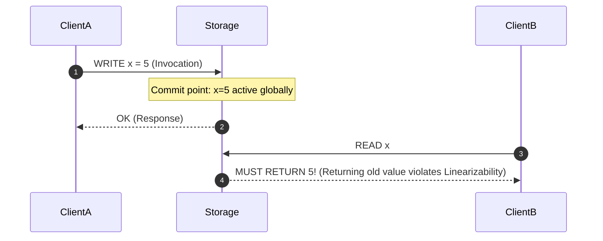

# Strong Consistency & Linearizability

## 1. Defining Linearizability
**Linearizability** (Strong Consistency) guarantees that all operations appear to execute atomically at a specific point in time between their invocation and response on a hypothetical single, global real-time clock.

---

## 2. Achieving Strong Consistency in Distributed Architectures
1. **Consensus Protocols (Raft / Paxos)**: Every state mutation requires majority quorum agreement before acknowledgement.
2. **TrueTime API (Google Cloud Spanner)**: Uses atomic clocks and GPS receivers in each data center to bound clock uncertainty ($\epsilon \le 7\text{ ms}$), providing externally consistent global serializability.
3. **Synchronous Two-Phase Locking (2PL)**: Distributed transactions acquire read and write locks across all participating shards.
