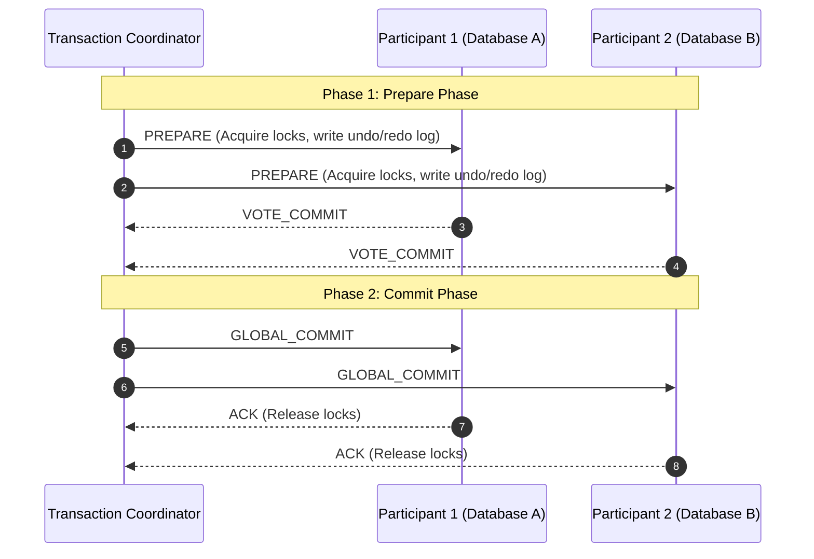

# Two-Phase Commit Protocol (2PC)

## 1. Protocol Flow
Two-Phase Commit is the classical distributed atomic commit protocol:

---

## 2. The Fatal Flaw: The Blocking Problem
* If the Coordinator crashes **after** participants vote `VOTE_COMMIT` but **before** issuing `GLOBAL_COMMIT`:
* All participants are left in a state of indefinite uncertainty.
* **Participants cannot unilaterally commit or abort**; they must hold exclusive locks indefinitely, freezing downstream rows and thread pools until human intervention or coordinator recovery.
