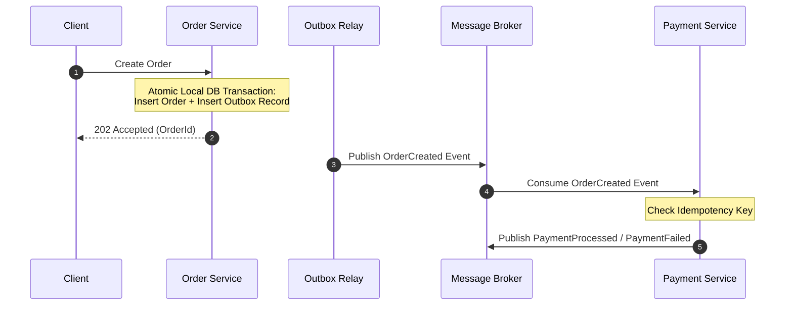

# Distributed Transactions: Saga Pattern: Choreography Architecture

## 1. Architectural Purpose & Problem Context
Decentralized event-driven saga execution: participants listen for domain events and trigger local transactions; benefits and troubleshooting challenges.

---

## 2. Distributed Workflow Architecture

---

## 3. Production Invariants
- Never use Two-Phase Commit (2PC) over wide-area networks or across microservice team boundaries.
- Every state-changing distributed command must support compensating transactions.
- Always implement the Transactional Outbox pattern when publishing events in response to database mutations to eliminate the dual-write hazard.
