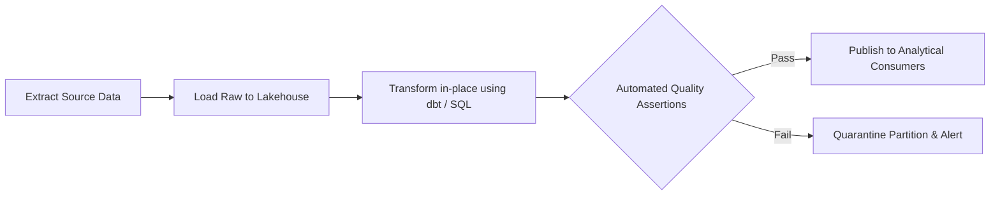

# ETL/ELT: Data Transformation & Modular Modeling with dbt

## 1. Architectural Purpose & Problem Context
Software engineering best practices applied to SQL: version-controlled models, modular CTEs, automated documentation, and CI testing.

---

## 2. ELT Pipeline Flow

---

## 3. Production Invariants
- Pipeline jobs must be strictly idempotent; re-running a job for date partition `T` must produce identical state without duplicate rows.
- Always execute data quality assertions before publishing data to production downstream consumers.
