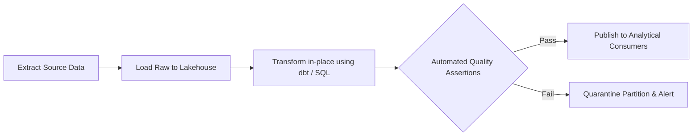

# ETL/ELT: ETL vs ELT Pipeline Architecture: Strategic Trade-offs

## 1. Architectural Purpose & Problem Context
Traditional ETL (transform before loading) vs modern cloud ELT (load raw data first, transform in-engine using MPP compute): cost, speed, and agility.

---

## 2. ELT Pipeline Flow

---

## 3. Production Invariants
- Pipeline jobs must be strictly idempotent; re-running a job for date partition `T` must produce identical state without duplicate rows.
- Always execute data quality assertions before publishing data to production downstream consumers.
