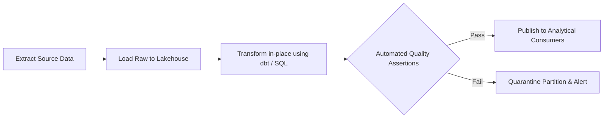

# ETL/ELT: Pipeline Orchestration Architecture (Airflow, Dagster, Prefect)

## 1. Architectural Purpose & Problem Context
DAG dependency graphs, sensor triggers, dynamic task mapping, asset-based orchestration, and handling task failures gracefully.

---

## 2. ELT Pipeline Flow

---

## 3. Production Invariants
- Pipeline jobs must be strictly idempotent; re-running a job for date partition `T` must produce identical state without duplicate rows.
- Always execute data quality assertions before publishing data to production downstream consumers.
