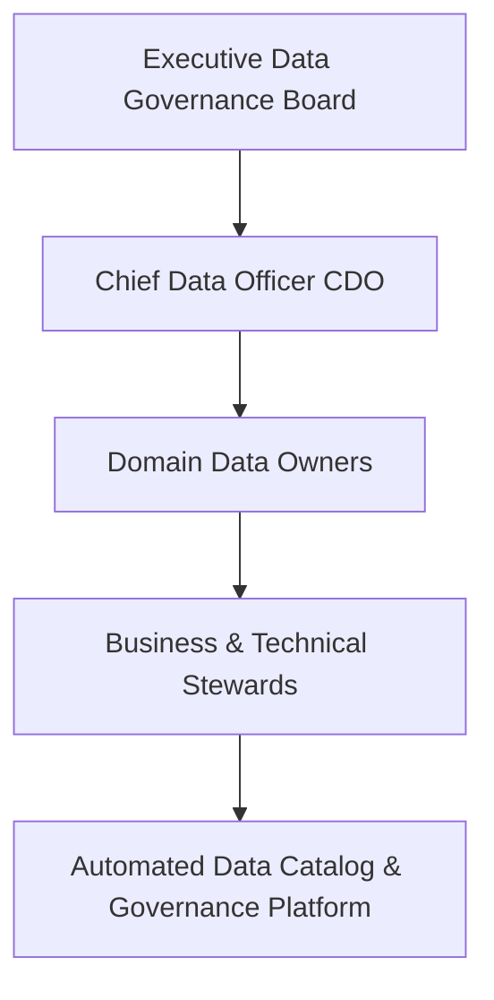

# Data Governance: Enterprise Data Governance Framework

## 1. Architectural Purpose & Problem Context
Core pillars: Data Security, Privacy, Quality, Master Data, Lifecycle Management, and defining enterprise data policies.

---

## 2. Governance Operating Model

---

## 3. Production Invariants
- All production datasets must be registered in the enterprise data catalog with explicit domain ownership tags.
- Access to sensitive or restricted data tiers requires explicit, time-bounded approval workflows.
