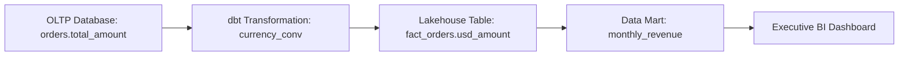

# Data Lineage: Data Lineage Overview & Extraction Architecture

## 1. Architectural Purpose & Problem Context
Automated lineage capture via query log parsing (OpenLineage, SQLGlot), execution engine instrumentation (Spark, dbt), and lineage graph visualization.

---

## 2. End-to-End Lineage Flow

---

## 3. Production Invariants
- Automated column-level lineage extraction must be instrumented across all production ETL and lakehouse pipelines.
- Lineage graphs must be queryable via APIs to support automated pre-deployment schema change blast-radius analysis.
