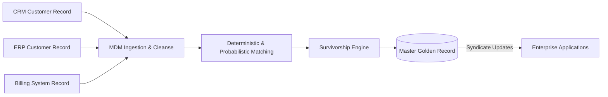

# MDM Architecture: Golden Record Creation & Matching Algorithms

## 1. Architectural Purpose & Problem Context
Deterministic vs probabilistic matching (Jaro-Winkler, Levenshtein, Soundex), match thresholds, and false-positive exception workflows.

---

## 2. MDM Golden Record Pipeline

---

## 3. Production Invariants
- Survivorship rules must be deterministic, transparent, and fully auditable.
- Unmatched records within the borderline confidence interval must be routed to human data stewards rather than automatically merged.
