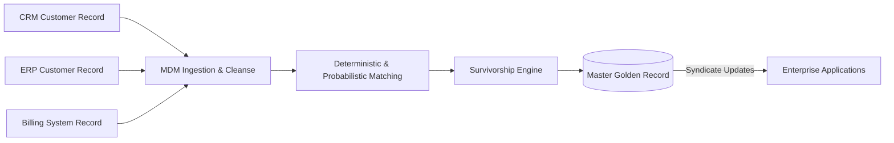

# MDM Architecture: MDM Governance, Stewardship & Synchronization

## 1. Architectural Purpose & Problem Context
Propagating master entity updates back to operational systems: event streaming, webhook syndication, and human data stewardship consoles.

---

## 2. MDM Golden Record Pipeline

---

## 3. Production Invariants
- Survivorship rules must be deterministic, transparent, and fully auditable.
- Unmatched records within the borderline confidence interval must be routed to human data stewards rather than automatically merged.
