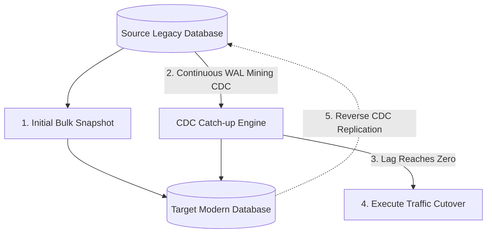

# Data Migration: Online vs Offline Data Migration Strategies

## 1. Architectural Purpose & Problem Context
Maintenance-window cold offline exports vs zero-downtime hot online continuous replication with incremental catch-up.

---

## 2. Zero-Downtime CDC Migration Topology

---

## 3. Production Invariants
- Every database migration must have an active reverse replication pipeline enabled for at least 72 hours post-cutover to allow instant zero-loss rollback.
- Never declare a migration complete without running automated 100% row count and checksum reconciliation across all migrated entities.
